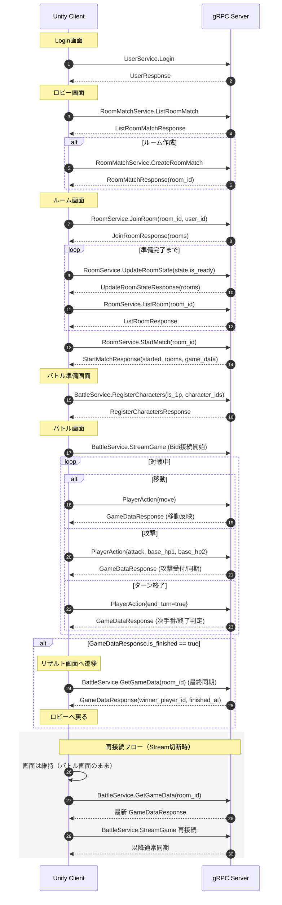

# Unity最小実装: 通信シーケンス図 & DB構造一覧

対象:
- フロント: Unity + C# (gRPC)
- サーバー: Go gRPC
- 範囲: ルーム入室〜ゲーム終了

## 1. 最小通信シーケンス（接続 / 再接続 / 画面遷移）

### 画面遷移タイミング（最小）
- Login成功: `Login画面 -> ロビー画面`
- JoinRoom成功: `ロビー画面 -> ルーム画面`
- StartMatch成功: `ルーム画面 -> バトル準備画面`
- RegisterCharacters完了 + Stream接続: `バトル準備画面 -> バトル画面`
- `GameDataResponse.is_finished == true`: `バトル画面 -> リザルト画面`
- リザルト確認後: `リザルト画面 -> ロビー画面`

## 2. Unityが呼ぶ主なRPC（最小）

- `UserService.Login`
- `RoomMatchService.ListRoomMatch`
- `RoomMatchService.CreateRoomMatch` (必要時)
- `RoomService.JoinRoom`
- `RoomService.UpdateRoomState`
- `RoomService.ListRoom` (ポーリング/再同期用)
- `RoomService.StartMatch`
- `BattleService.RegisterCharacters`
- `BattleService.StreamGame` (Bidi)
- `BattleService.GetGameData` (再接続時/最終同期)

### 2.1 攻撃処理の現状
- `PlayerAction` に `attack` が追加済み
- Unityは `BattleService.StreamGame` へ `AttackAction` を送信可能
- サーバーは手番/所有/生存チェック後、`attack_infos` に記録
- ダメージ計算と拠点HP計算はフロント側で実施し、`AttackAction.base_hp1/base_hp2` を送信
- サーバーは受け取った `base_hp1/base_hp2` を `game_data` に保存して同期
- キャラクターへのダメージ計算もフロント側で実施し、`AttackAction.attacked_character_unique_id` と `new_hp` を送信（0の場合は更新スキップ）
- サーバーは受け取った `new_hp` を `unique_characters.hp` に保存して同期
- 処理結果は最新 `GameDataResponse` として返却される

## 3. データベース構造一覧（現行モデルベース）

> GORMの自動命名に従うため、実テーブル名は通常 snake_case 複数形になります。

### 3.1 users
- `id` (char(36), PK)
- `name` (unique)
- `hash`
- `story`
- `num_wins`
- `num_battles`
- `rate`
- `home_character_id`
- `deck_1`, `deck_2`, `deck_3`

### 3.2 room_matches
- `id` (PK, auto increment)
- `room_name`
- `owner_id`
- `is_gaming`

### 3.3 rooms
- `id` (char(36), PK)
- `room_id` (index, room_matches.id に対応)
- `user_id`
- `state` (0=観戦, 1=1P, 2=2P)
- `is_ready`
- `joined_at`

### 3.4 game_data
- `id` (PK)
- `room_id` (unique index)
- `player1_id`
- `player2_id`
- `base_hp1`, `base_hp2`
- `turn`
- `is_1p_turn`
- `turn_start_at`
- `is_finished`
- `winner_player_id` (nullable)
- `finished_at` (nullable)

### 3.5 unique_characters
- `id` (PK)
- `room_id` (index)
- `is_1p`
- `is_selected` (default false)
- `character_id`
- `hp`
- `position_x`, `position_y`

### 3.6 character_conditions
- `id` (PK)
- `unique_character_id` (index)
- `condition_id`
- `lasting_turn`

### 3.7 attack_infos
- `id` (PK)
- `room_id` (index)
- `attacker_side`
- `is_started`
- `attacker_character_id` (nullable, index)
- `attack_type`
- `attacked_at`

## 4. 関係（最小）
- `room_matches (1) - (N) rooms` by `rooms.room_id`
- `game_data (1) - (N) unique_characters` by `room_id`
- `unique_characters (1) - (N) character_conditions` by `unique_character_id`
- `attack_infos` は `room_id` 単位でゲーム内攻撃状態を保持

## 5. 実装メモ（現在の仕様）
- `StreamGame` の `move` は位置更新を行う
- `StreamGame` の `attack` は `attack_infos` へ保存し、`is_selected` を更新する
- `GetGameData` / `ApplyMove` / `EndTurn` で終了条件（拠点HP 0）を検知した場合、終了処理とElo更新を確定
- `UniqueCharacter.is_selected` は proto に露出済み
- 攻撃は gRPC 経由で送信可能（`PlayerAction.attack`）

## 6. 実装済み関数一覧（主要）

### 6.1 gRPCハンドラー
- `UserHandler`: `CreateUser`, `Login`, `UpdateUser`, `DeleteUser`, `GetUser`, `ListUsers`
- `RoomMatchServer`: `CreateRoomMatch`, `ListRoomMatch`
- `RoomHandler`: `JoinRoom`, `ListRoom`, `UpdateRoomState`, `StartMatch`
- `BattleHandler`: `CreateGame`, `GetGameData`, `RegisterCharacters`, `StreamGame`

### 6.2 リポジトリ（GORM）
- `UserRepository`: `Create`, `FindByID`, `FindAll`, `FindByName`, `Update`, `Delete`
- `RoomMatchRepository`: `CreateRoomMatch`, `FindAll`
- `RoomRepository`: `JoinRoom`, `ListRoom`, `UpdateRoomState`, `StartMatch`
- `BattleRepository`: `CreateGame`, `GetGameDataByRoomID`, `RegisterCharacters`, `ApplyMove`, `ApplyAttack`, `EndTurn`

### 6.3 BattleRepository内部の主要ロジック
- `loadGameDataByRoomID`: GameData + Characters + Conditions を取得
- `finalizeGameIfNeeded`: 拠点HP0時の終了確定
- `finishGameAndUpdateRatings`: 勝敗確定 + Elo更新 + ルーム終了反映
- `recalculateTurnStarter`: 先攻再計算
- `determineNextActor` / `minAliveMoveCost`: 手番判定
- `calculateEloRates`: Elo計算本体
